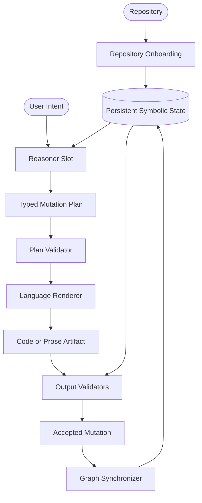

# GOG Architecture: Persistent Symbolic State for Software Generation

## 1. The Vision
Graph-Oriented Generation (GOG) investigates whether software generation improves when codebases are first transformed into persistent symbolic state, that state is presented to a higher-level reasoner, and language models are demoted from architects to renderers.

The core idea is not merely that graphs can retrieve better context. The deeper claim is that a repository should be graphized before agentic work begins, so every later request can be presented to a reasoner through durable symbolic state rather than reconstructed from scratch.

GOG is not the reasoner. It is the symbolic substrate, serving layer, and validation scaffold that should help a reasoner act with more repo awareness than unstructured text retrieval alone provides.

---

## 2. The System Layers
GOG separates repository understanding, reasoning, rendering, validation, and synchronization into explicit layers.

### Layer A: Repository Onboarding
- **Role:** Parse the repository into persistent symbolic state.
- **Output:** Graph artifacts, repo profile, constraints, and refresh metadata.
- **Constraint:** Assistant-style reasoning should not begin until the symbolic substrate exists or the system explicitly marks itself incomplete.

### Layer B: Reasoner Slot
- **Current implementation:** Deterministic planners for narrow task families and experiments that may substitute a large LLM constrained to structured output.
- **Future hypothesis:** A dedicated symbolic reasoning model.
- **Role:** Consume intent plus GOG-served symbolic repo state and convert that representation into a typed plan.
- **Output:** A structured `MutationPlan`, graph queries, explicit constraints, and validation requirements.
- **Constraint:** It does **not** emit raw source code.

At prompt time, GOG should serve the reasoner a bounded symbolic context bundle derived from onboarded repo state, not the full repository graph.

### Layer C: Renderer
- **Model:** Potentially a small language model.
- **Role:** Translate one bounded plan step at a time into code syntax or human-facing language.
- **Constraint:** It renders the plan; it does not invent repo architecture.

### Layer D: Validators
- **Role:** Verify graph boundaries, syntax, dependency constraints, and eventually toolchain correctness.
- **Output:** Accepted, rejected, or patched artifacts with explicit reasons.
- **Current checkpoint:** The SalienceEvaluator remains the final anti-hallucination guard while the manipulator reasoner is LLM-backed.

### Layer E: Graph Synchronizer
- **Role:** Update the symbolic repository state after accepted edits.
- **Constraint:** GOG must stay synchronized with the living repo or declare itself stale. The loop closes only when `.gog/` reflects the accepted change.
- **Current CLI surface:** `gog refresh` performs a full artifact rebuild after accepted changes. Incremental refresh comes later.

---

## 3. Codebase Changes as Graph Mutations
In GOG, editing code becomes a graph-aware mutation problem rather than a free-form text completion problem.

### The Mutation Paradigm
A feature request like "Add a logout button to the header" is decomposed into:
1. **ADD_NODE**: Create `src/components/LogoutButton.vue`.
2. **ADD_EDGE**: `src/components/Header.vue` imports `LogoutButton.vue`.
3. **ADD_EDGE**: `LogoutButton.vue` imports `useAuthStore` from `src/stores/authStore.ts`.
4. **MUTATE_NODE**: Inject the component usage and binding into existing files.

### MutationPlan JSON Schema (Proposed)
```json
{
  "plan_id": "string",
  "intent": "string",
  "steps": [
    {
      "op": "ADD_NODE | REMOVE_NODE | ADD_EDGE | REMOVE_EDGE | MUTATE_NODE",
      "target": "file_path",
      "params": {
        "description": "Natural language instruction for the renderer",
        "context_nodes": ["list", "of", "required", "nodes"],
        "snippet_hint": "optional structural hint"
      },
      "validation_rules": ["no_circular_deps", "matches_interface"]
    }
  ],
  "render_order": ["topological_sort_of_steps"]
}
```

---

## 4. The Reasoner Slot
The repo does not yet define the final symbolic reasoning model. That is a research target, not a missing implementation detail.

- **Current state:** Narrow deterministic planners exist, and a large LLM can be substituted as a reasoner proxy for broader tasks.
- **Future state:** A symbolic reasoning model operates directly over repository state and emits deterministic inputs for downstream renderers.

The important architectural decision is to stabilize the reasoner interface now so the internal reasoning mechanism can evolve later.

---

## 5. Benchmarking & Metrics
GOG should be evaluated as a layered system, not only as a retrieval comparison and not only by first-attempt token totals.

| Metric | Definition | Why It Matters |
|--------|------------|----------------|
| **Plan Validity** | Does the reasoner reference supported nodes, edges, and mutations? | Measures reasoning quality separately from rendering. |
| **Target Recall** | Did the reasoner identify the files or symbols actually needed? | Measures symbolic repo usefulness. |
| **Render Fidelity** | Does output follow the plan without inventing architecture? | Measures renderer discipline. |
| **Executable Correctness** | Does the patch parse, typecheck, build, or pass tests? | Measures software usefulness. |
| **Graph Synchronization** | Does accepted work update symbolic state correctly? | Measures whether GOG remains repo-resident. |
| **Tokens to Pass** | Cumulative tokens consumed before a validated passing solution appears. | Measures cost to actual success rather than cost to fail. |
| **Attempts to Pass** | Number of reasoning/render/repair cycles before validation clears. | Measures convergence quality. |
| **Best Quality Under Budget** | Best validated result within a fixed token or time budget. | Measures engineering usefulness under realistic constraints. |

---

## 6. Architecture Sketch



---

## 7. Next Steps & Investigation
1. **Formalize onboarding artifacts:** Persist a repo profile, graph metadata, freshness checks, and validation capabilities.
2. **Stabilize the reasoner contract:** Define the structured plan interface independent of whether the reasoner is deterministic or LLM-backed.
3. **Generalize the symbolic substrate:** Extend beyond dependency graphs toward symbols, workflows, and repo conventions.
4. **Benchmark public repositories rigorously:** Use real tasks, executable validation, and separate scoring for planning, rendering, and end-to-end success.
5. **Measure cost to validated success:** Track tokens-to-pass, attempts-to-pass, and best-quality-under-budget instead of treating cheap failure as a win.
6. **Keep the final symbolic reasoner hypothesis open:** Use large LLMs as proxies now without confusing them for the destination.

For deeper detail, see:

- [docs/GOG_SYSTEM_MODEL.md](./docs/GOG_SYSTEM_MODEL.md)
- [docs/REASONER_INTERFACE.md](./docs/REASONER_INTERFACE.md)
- [docs/REPO_ONBOARDING_PIPELINE.md](./docs/REPO_ONBOARDING_PIPELINE.md)
