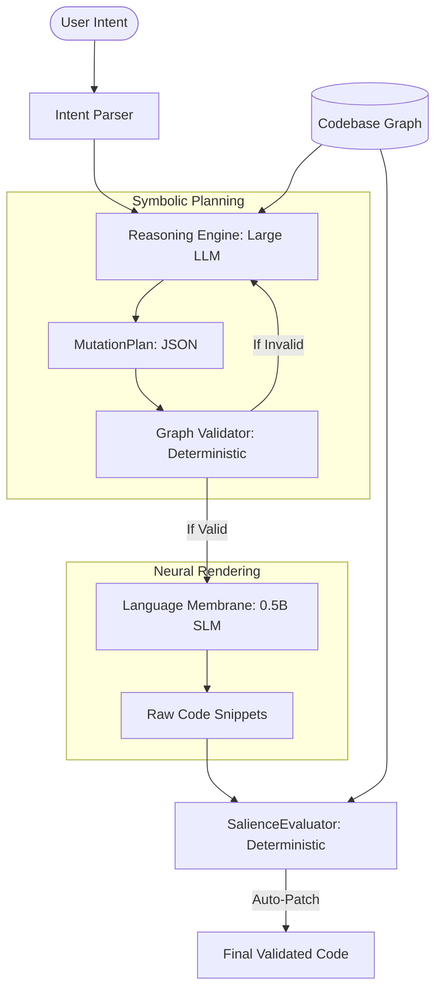

# GOG Architecture: From Neural RAG to Symbolic Generation

## 1. The Vision
Graph-Oriented Generation (GOG) is a paradigm shift in AI-assisted coding. Most current tools treat the codebase as a collection of text strings (Vector RAG) and the LLM as a stochastic architect. 

**The GOG thesis:** A codebase is a finite, deterministic space that can be mapped to a graph structure. Reasoning about architectural changes should happen at the graph level (symbolic), while the generation of syntax should happen at the language level (neural).

---

## 2. The Two-Model Architecture
To solve the "Scoping Challenge" (where small models can't architect and large models hallucinate structure), GOG separates reasoning from rendering.

### Tier A: The Reasoning Engine (Architect)
- **Model:** Large LLM (e.g., Claude 3.5, GPT-4o) or deterministic planner.
- **Role:** Understands user intent and codebase topology.
- **Output:** A structured `MutationPlan` (JSON). It does **not** write code.
- **Constraint:** Must only reference nodes and edges existing in the codebase graph or explicitly planned for creation.

### Tier B: The Language Membrane (Renderer)
- **Model:** Small SLM (e.g., Qwen 2.5 0.5B, Gemma 2 2B).
- **Role:** Translates one atomic mutation step at a time into code syntax.
- **Constraint:** Operates in a "Headless" mode (no conversational text) within a strict graph-isolated context window.

---

## 3. Codebase Changes as Graph Mutations
In GOG, we stop treating "editing code" as a text manipulation problem and start treating it as a **Graph Mutation** problem. 

### The Mutation Paradigm
A feature request like "Add a logout button to the header" is decomposed into:
1. **ADD_NODE**: Create `src/components/LogoutButton.vue`.
2. **ADD_EDGE**: `src/components/Header.vue` imports `LogoutButton.vue`.
3. **ADD_EDGE**: `LogoutButton.vue` imports `useAuthStore` from `src/stores/authStore.ts`.
4. **MUTATE_NODE**: Inject the component usage and binding into existing files.

### MutationPlan JSON Schema (Proposed)
```json
{
  "plan_id": "string",
  "intent": "string",
  "steps": [
    {
      "op": "ADD_NODE | REMOVE_NODE | ADD_EDGE | REMOVE_EDGE | MUTATE_NODE",
      "target": "file_path",
      "params": {
        "description": "Natural language instruction for the renderer",
        "context_nodes": ["list", "of", "required", "nodes"],
        "snippet_hint": "optional structural hint"
      },
      "validation_rules": ["no_circular_deps", "matches_interface"]
    }
  ],
  "render_order": ["topological_sort_of_steps"]
}
```

---

## 4. The Symbolic Reasoning Layer (The Endgame)
While Phase 1 uses a Large LLM as the Reasoning Engine, the goal is to transition to a **Pure Symbolic Layer**.

- **Current State:** Large LLM "architects" the plan via stochastic reasoning.
- **Future State:** A deterministic graph reasoning engine identifies architectural patterns, calculates topological impacts, and assembles the `MutationPlan` using formal logic and graph algebra. 

This removes the last "black box" from the architectural decision-making process.

---

## 5. Benchmarking & Metrics
To prove GOG's superiority over traditional RAG, we track the following:

| Metric | Definition | Why It Matters |
|--------|------------|----------------|
| **Topological Integrity** | % of generated imports that exist in the graph | Measures hallucination reduction. |
| **Context Density** | (Required Tokens / Total Tokens) | Measures efficiency and cost. |
| **Pass@1 Correctness** | % of tasks succeeding on first attempt | Measures reliability of the deterministic plan. |
| **Closure Verification** | Does the generated code reference symbols outside the plan? | Ensures architectural boundaries are respected. |

---

## 6. Architecture Sketch



---

## 7. Next Steps & Investigation
1. **Formalize the Mutation Schema:** Solidify the JSON structure for multi-file coordination.
2. **Abstract the Parser:** Generalize `ts_parser.py` into a universal interface for Python, Go, and Rust.
3. **Build the Tiered Pipeline:** Implement the "Architect -> Renderer" flow in `benchmark_local_llm.py`.
4. **Real-World Stress Test:** Move from dummy repos to real, complex open-source codebases.
